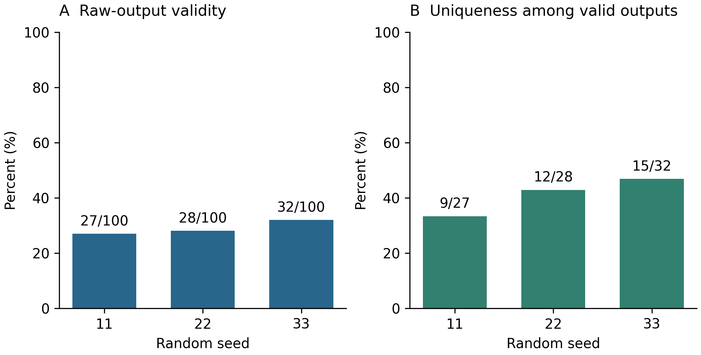
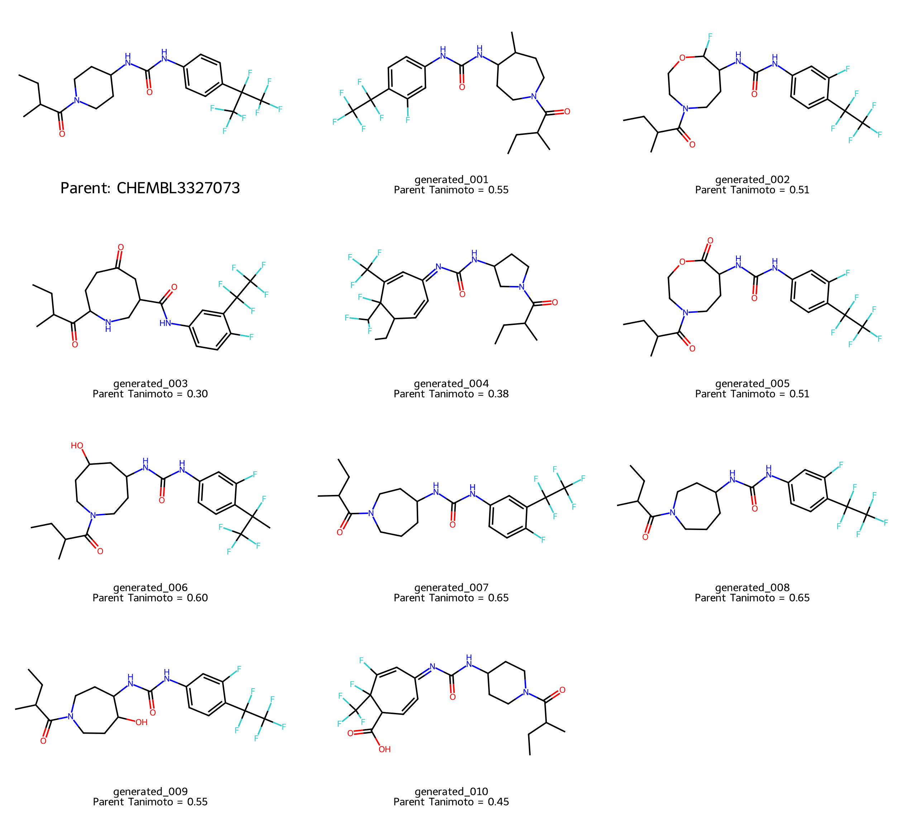

# Figures from the prospective revision measurements

These figures are new outputs from the recorded revision experiments, not
recovered versions of the original manuscript figures. They have been rendered
and visually inspected. PDF and SVG preserve vector structures, labels, and
plot geometry; PNG files are previews.

## Generation rates



**Proposed caption.** Validity and uniqueness for three seeded local-latent
generation runs around CHEMBL3327073. Each run produced 100 raw backend outputs.
(A) RDKit-valid nonempty molecules divided by all raw outputs. (B) Distinct
standardized valid molecules divided by valid standardized outputs. Numerators
and denominators are shown above the bars. Standardization removes
stereochemistry. Pooled validity is 87/300 (29.0%); the 87 valid outputs contain
23 distinct standardized compounds. These results characterize the recorded
sampling settings and do not establish biological activity or synthetic
feasibility. Raw outputs and parameters are identified in the accompanying
generation table and manifest.

## Parent and predeclared retrosynthesis targets



**Proposed caption.** CHEMBL3327073 and ten generated structures selected before
retrosynthesis searches. The 22 distinct nonparent candidates were ranked by
SHA-256 of `42|<canonical SMILES>`; the first ten were selected. The displayed
similarity is Morgan radius-two, 2,048-bit Tanimoto similarity to the standardized
parent. Identifiers match the target list and subsequent planning results. The
structures are computational proposals, with no experimental activity or
synthetic-feasibility validation. The image does not imply confirmed training-set
novelty.

Reproduce both figures from the committed measured tables:

```bash
PYTHONPATH=src python scripts/render_revision_figures.py
```

The input and output checksums are in `figure_manifest.json`. Inspect the vector
versions at the intended final journal size after integration into the paper.
Original GTM and route-figure replacements remain separate work.
